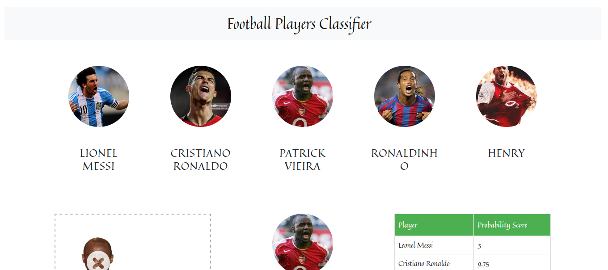
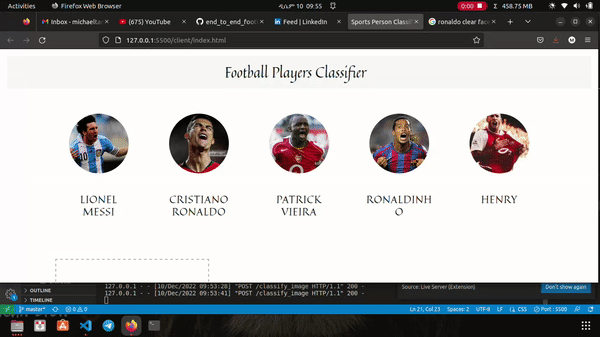

# End to end machine learning project for football player image classification

> In this project I have collected photos of my all time favourite players and tried to do EDA. After performing EDA I trained multiple models and took the best one. Then I build a UI for user to drag and drop his/her own player image and the Flask server will come up with the prediction.

 

> I took the dataset from [here](https://www.kaggle.com/datasets/balabaskar/golden-foot-football-players-image-dataset?resource=download) and also by manual downloading using the Fatkun batch image downloader.

## Built With

- Python, HTML, CSS, JavaScript, jQuery
- Flask

## Getting Started

> git clone `https://github.com/Micky373/end_to_end_football_players_image_classification.git`

> cd end_to_end_football_players_image_classification

> pip install -r requirements.txt

> cd server

> python sever.py

> After the flask server is succesfully loaded go to the client directory and open the html `cd ../client`

> Then the UI will open 

> Here drag and drop a clear picture of one of the 5 players and click classify

> In the test_images section I have provided 5 sample images you can check the classification using those too

> All the EDA, model training and predicting is clearly shown in the note books found in the `notebooks` folder.

> Currently I have worked on simpler less number of images, my future plan is to come up with a robust model trained with vast data.

## Author

- GitHub: [@GitHub](https://github.com/Micky373)

- LinkedIn: [LinkedIn](https://www.linkedin.com/in/michaeltamirie/)

## 🤝 Contributing

Contributions, issues, and feature requests are welcome!

Feel free to check the [issues page](https://github.com/Micky373/end_to_end_home_price_prediction_ml_project).

## Show your support

Give a ⭐️ if you like this project!

## Acknowledgments

- Special thanks to [Dhaval Patel](https://www.linkedin.com/in/dhavalsays/), who provided the tutorial for the house prediction model
- The UI implementation and code flow done with the help of [this play list](https://youtube.com/playlist?list=PLeo1K3hjS3ut2o1ay5Dqh-r1kq6ZU8W0M) video

## 📝 License

This project is [MIT](./MIT.md) licensed.
